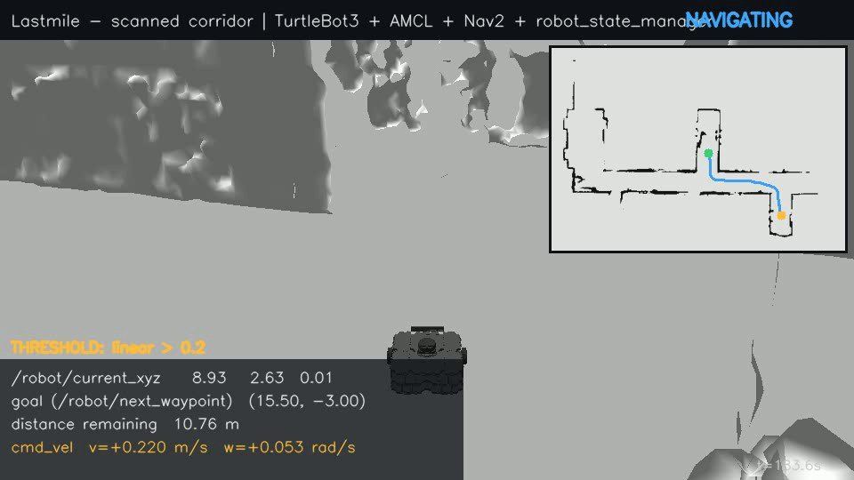
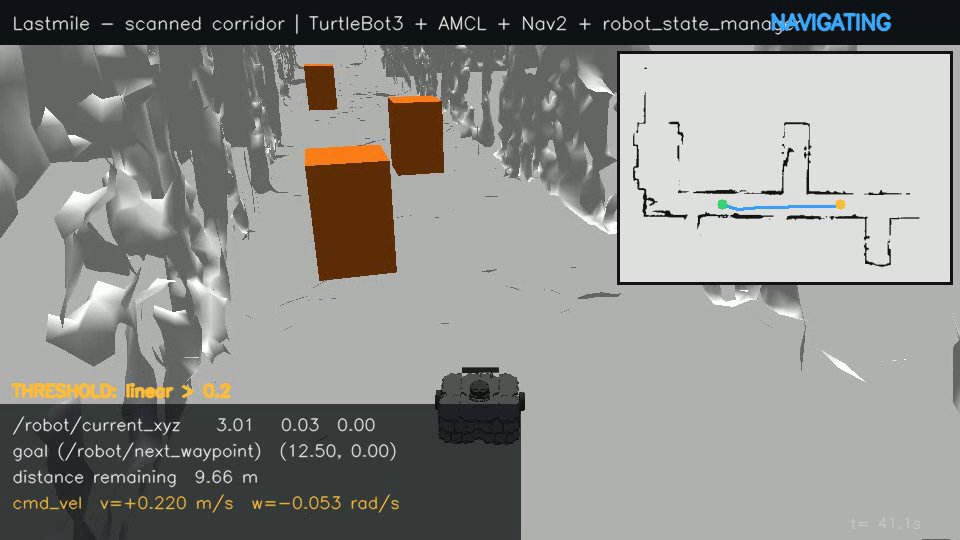
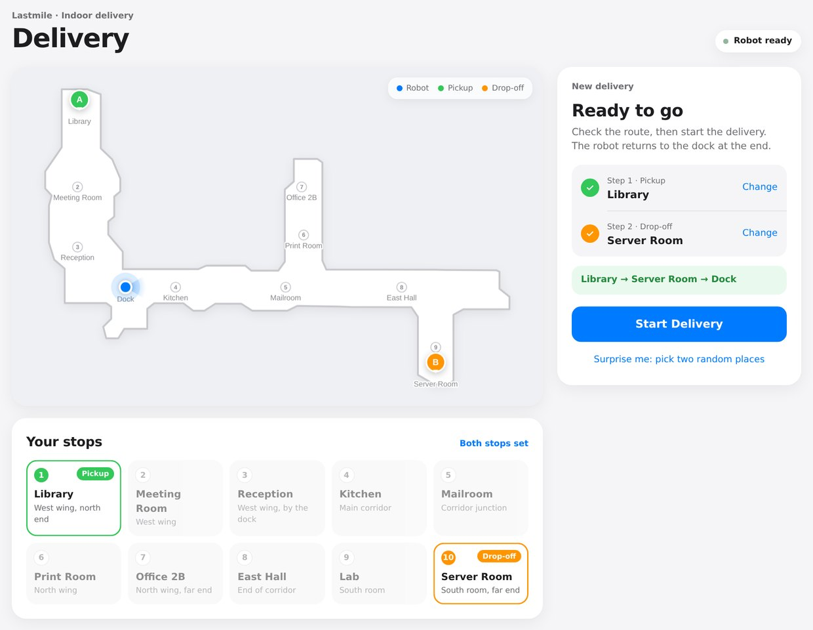

# Real-World Indoor Navigation & State Monitoring

A real point-cloud scan of a building corridor → a collidable Gazebo world →
a 2D map with AMCL localization → Nav2 point-to-point navigation, driven and
monitored by a custom ROS 2 node (`robot_state_manager`), plus a live browser
dashboard.

**Stack:** ROS 2 Humble · Gazebo Classic 11 · Nav2 · TurtleBot3 Waffle ·
Ubuntu 22.04 on WSL2 (Windows 11). Python for every custom piece.



**Demo video:** [docs/demo.mp4](docs/demo.mp4) — fresh start, three waypoints sent through `/robot/next_waypoint`, rendered by a Gazebo chase camera with the Task 3 telemetry overlaid (recorded headless by `scripts/record_demo.sh`).

---

## Results (measured, not assumed)

Everything below was run end-to-end in this setup; numbers are copied from the
logs (`scripts/waypoint_test.sh` records the Task 3 node's localized pose and
Gazebo's ground-truth model pose at every arrival).

| Check | Result |
|---|---|
| Robot spawns at the assignment's origin (0, 0, 0) inside the scanned mesh | ✅ ground truth `(0.002, 0.000)` after settling |
| TF chain `map → odom → base_footprint → base_scan` | ✅ all present; AMCL republishes `map → odom` at ~5 Hz even when stationary |
| AMCL accuracy vs Gazebo ground truth | ✅ 5–16 cm at goal arrivals (table below) |
| `/robot/current_xyz` rate | ✅ **10.0–10.1 Hz** (`ros2 topic hz`) |
| `/robot/next_waypoint` → `NavigateToPose` → robot drives and arrives | ✅ multi-waypoint run below |
| `/cmd_vel` threshold monitor | ✅ logs every excursion (e.g. `linear speed 0.220 m/s exceeds threshold 0.20 m/s`, `angular speed 1.000 rad/s exceeds threshold 0.80 rad/s (turning fast)`) |
| Dashboard: send goals, live pose/map/plan/lidar, cmd_vel, nav status, health, history | ✅ `http://localhost:8080` |
| Obstacle mode: 3 unmapped boxes found by lidar and avoided | ✅ slalom to (12.5, 0), 0 recoveries, 0.33–0.47 m clearance ([details](#obstacle-avoidance-mode-extra)) |
| Delivery page: pick A and B from 10 places, Loaded/Unloaded, return to dock, stays inside the building | ✅ 5 missions across the whole building with obstacles on ([details](#delivery-mode-extra)) |

Multi-waypoint run through `/robot/next_waypoint` (cold start, TurtleBot3 at origin):

| # | Goal (map) | Result | Wall time | Localized pose at arrival | Gazebo ground truth | AMCL error |
|---|---|---|---|---|---|---|
| 1 | (8.0, 0.0) E corridor | ✅ succeeded, 0 recoveries | 72 s | (7.77, −0.04) | (7.82, −0.02) | 0.05 m |
| 2 | (8.8, 5.0) north arm | ✅ succeeded, 0 recoveries | 67 s | (8.84, 4.74) | (8.83, 4.85) | 0.12 m |
| 3 | (15.5, −3.0) south room | ✅ succeeded, 1 recovery | 145 s | (15.40, −2.84) | (15.56, −2.85) | 0.16 m |

(Goal tolerance is 0.25 m; "wall time" includes Gazebo running at ~0.8× real time. This is the run in the demo video.)

---

## What the provided data actually is

`map_ros_cloud.ply` is a **raw point cloud, not a mesh**: binary PLY,
2,338,923 points with xyz + rgb + normals and `element face 0`. It is
already in metres (≈ 28 m × 16.5 m × 4.85 m), close to gravity-aligned
(RANSAC floor normal within ~1.3° of +z, ~2 cm offset), and it is a walked
SLAM scan of a **corridor intersection**: a long E–W corridor with a north
arm, a south room and a west wing, open at the ends.

Two properties of the scan drove most of the engineering:

1. **The floor is not one plane.** After SLAM the floor height drifts by
   about ±10 cm across the site. Anything that measures height above a
   single global floor plane misclassifies floor as obstacle in places.
2. **The scan origin is full of ghost points.** (0, 0) is where the scanner
   started; people walking by and sensor noise left a haze of sparse points
   there at all heights. A "any point in the height band ⇒ occupied" rule turns
   that haze into a solid block.

(1) and (2) together are why an earlier version of this pipeline concluded
that "(0, 0, 0) is inside a wall" and moved the spawn. **It isn't**: (0, 0)
is open corridor with 0.86 m clearance to the nearest wall (checked on the
occupancy grid *and* by ray-casting the Gazebo mesh). The robot now spawns
exactly where the assignment asks.

---

## Task 1 — Environment integration (Gazebo)

`scripts/preprocess_cloud.py` → `scripts/cloud_to_mesh.py` →
`scripts/make_collision_mesh.py` → `src/lastmile_description/models/scanned_environment/`

* **Preprocess:** voxel downsample (3 cm), statistical outlier removal,
  RANSAC floor fit; the rotation + offset is saved to
  `data/floor_transform.json` so every later stage uses the same frame.
* **Mesh:** Poisson reconstruction with density-based trimming (Poisson
  otherwise invents surfaces across the scan's holes), decimated to 150 k
  triangles → `environment.obj`. **Scale is 1:1** — the cloud is already in
  metres and the SDF uses `<scale>1 1 1</scale>`.
* **Collision:** the model is `<static>` with
  * visual = the full reconstructed mesh,
  * collision = `environment_collision.obj` (walls/obstacles only: near-
    horizontal triangles below 0.25 m and everything below 0.12 m removed)
    **+ a flat ground plane at z = 0**.

  Why split: with the bumpy Poisson floor as the drive surface the robot
  first fell through gaps into free fall (`/odom` z in the millions), and after
  that was patched it came to rest on floor bumps with its wheels unloaded and
  would not move under `/cmd_vel`. A flat analytic ground gives stable wheel
  contact; walls still collide and are still what the lidar sees.
* **Spawn:** `spawn_world.launch.py` spawns the TurtleBot3 Waffle at
  **(0, 0)**, dropped from 10 cm so it settles on the floor, and starts
  `robot_state_publisher` (see Task 2 for why that line matters).

## Task 2 — Map generation & localization

**Pre-generated 2D map** (`.pgm` + `.yaml`) from the cloud —
`scripts/cloud_to_occupancy_grid.py` (numpy/scipy only, reads the raw PLY):

1. apply the floor transform;
2. **local floor height** per 0.25 m tile (10th percentile of low points,
   holes filled from neighbours, median-smoothed) — heights are measured
   above the *local* floor;
3. a 5 cm cell is **occupied only with real vertical structure**: ≥ 40 points
   spanning ≥ 8 distinct 5 cm height bins within 0.12–1.60 m (or ≥ 150
   points). Walls have hundreds of points over the full height; ghost haze
   doesn't;
4. **free = cells where floor was actually observed**, minus obstacles,
   connected to the spawn. Never-observed space is written as *unknown*
   (grey), unlike v1, which flood-filled "free" out to the bounding box.
   `lastmile_map.yaml` uses `free_thresh: 0.25`, so map_server loads those grey
   cells as free for Nav2: some real floor (e.g. the west side of the north arm)
   was only partly scanned and must stay drivable.
5. **Bounded planning map.** Treating unknown as free has one catch: where a
   wall has a scan gap (the corridor's north wall around x = 2–6 m), the
   planner could route *through* the gap into unscanned space outside the
   building. `scripts/make_nav_map.py` derives `lastmile_nav_map.pgm`: identical
   inside the cleaned building outline (+15 cm), occupied everywhere outside it.
   A second map_server (`nav_map_server`) publishes it on `/nav_map`, and both
   costmaps' static layers read `/nav_map`; **AMCL keeps localising on the
   honest `/map`**. Two small round **corner keep-outs** at the mouth of the
   north arm are also marked occupied there (see the debugging table). The script
   is deterministic (regenerates the committed file byte-for-byte).

Result: 529 × 367 cells @ 5 cm, 32,639 free / 4,872 occupied / rest unknown.
The script regenerates the committed map byte-for-byte.

**Localization:** AMCL (likelihood field) on that map, seeded at (0, 0, 0)
via `set_initial_pose`. `map → odom` from AMCL + `odom → base_footprint`
from the Gazebo diff-drive plugin + `base_footprint → base_link → base_scan`
from `robot_state_publisher`.

### The debugging that got localization working (in order)

| Symptom | Root cause | Fix |
|---|---|---|
| AMCL: *Message Filter dropping message*, `map` frame never appears, `global_costmap` stuck | **No `robot_state_publisher`**: the launch spawned the robot but never published its URDF transforms, so `base_scan` didn't exist and AMCL couldn't place a single scan | `spawn_world.launch.py` now starts TurtleBot3's `robot_state_publisher` with sim time |
| Planner failed from the spawn (start in lethal cost) | v1 map: ghost haze near (0, 0) + floor drift = a fake wall at the origin | map v2 (above) |
| Scan has 0.12–0.16 m returns around the robot; costmap marks the robot's own footprint | lidar hitting the Waffle's own chassis/camera mount (mesh ray-cast shows nothing within 0.6 m) | `obstacle_min_range: 0.3` (costmaps) and `laser_min_range: 0.3` (AMCL) |
| Robot doesn't move although `/cmd_vel` = 0.208 m/s | resting on the noisy Poisson floor | collision mesh without floor + ground plane |
| Global plan always starts at (0, 0) while the robot is at x = 4 → controller "Resulting plan has 0 poses" | the **global** costmap froze: its footprint and TF buffer stopped updating (t = 73 s) | global costmap = static + inflation |
| After a cold start every goal instantly "succeeds" with the robot still at (0, 0) (`tf_help: Transform data too old ... Transform time: 38.6s` forever) | same freeze in the **local** costmap: the laser obstacle layer's tf2 MessageFilter deadlocks the costmap's TF buffer during startup (timing-dependent; frequent with Gazebo below real time under WSL2). With no usable map→odom the Humble controller compares the robot against an all-zero goal and reports "Reached the goal!" | local costmap = static layer + inflation too (walls come from the scan's map). Verified: 3 cold starts with an immediate goal, 0 TF errors, robot drives. Trade-off: obstacles that are not in the scan are not avoided — acceptable for a static scanned world. The Task 3 node also flags any SUCCEEDED that isn't within 0.5 m of the goal. |
| Stop-and-go on the way down the corridor ("recoveries" with no obstacle) | bt_navigator's default 20 ms `default_server_timeout`: under load the planner/controller take longer to *acknowledge* a request, the BT counts it as a failure and runs a recovery | `default_server_timeout: 500`, `controller_frequency: 10` (20 Hz was routinely missed) — recoveries on the E corridor leg went from 5 to 0 |
| Delivery page: on the way back to the dock the robot left the building and drove through unscanned space | map_server loads unknown (grey) as free (`free_thresh 0.25`, needed for half-scanned floor), and the corridor's north wall has scan gaps, so NavFn routed through a gap | bounded planning map `lastmile_nav_map.pgm` (outside the building outline = occupied) on `/nav_map` for both costmaps; AMCL unchanged. Verified: 0 of ~76,000 logged plan points outside the building |
| …but in obstacle mode the robot still planned outside | the global costmap isn't size-locked, so every `/obstacle_map` message re-sized the costmap and wiped the other StaticLayer's copy of `/nav_map` (a costmap dump showed no outside walls) | `obstacle_mapper` publishes the `/nav_map` walls underneath its detections |
| Leaving the north arm westbound, the robot stopped in the corner and every replan failed ("failed to create plan", backup "Collision Ahead") | DWB cut the tight 90° turn and put the robot centre inside the wall's inscribed zone, where NavFn cannot start a path | two 0.25 m corner keep-outs at the arm's mouth in the planning map, so the path (and DWB) turn wider. Regulated Pure Pursuit (+ rotation shim) was also tried: it tracked the corner well but turned in place back and forth in this below-real-time sim, so DWB stays |
| Robot clipped a slalom box when the route turned right after passing it | DWB shaves inside corners; detections were grown by only 5 cm | `obstacle_mapper` grows detections by 10 cm (`inflate_cells: 2`) |
| Intermittent DDS delivery issues under WSL2 | Fast DDS shared-memory transport | `config/fastdds_udp_only.xml` (UDP only), exported by `scripts/run_demo.sh` |

## Task 3 — `robot_state_manager` (custom node, rclpy)

`src/robot_state_manager/robot_state_manager/robot_state_manager_node.py`

| Assignment item | Implementation |
|---|---|
| Position publisher | Publishes `[x, y, z]` as `std_msgs/Float32MultiArray` on **`/robot/current_xyz` at 10 Hz**. Source = localized pose (TF `map → base_footprint`, i.e. AMCL ∘ odometry); falls back to `/odom` until TF is available (`pose_source:=odom` forces odometry). The timer runs on the **wall clock**: Gazebo runs at RTF ≈ 0.8 with this mesh, and a sim-time timer gave only 7.6 Hz real time. |
| Goal receiver | Subscribes **`/robot/next_waypoint`** (`geometry_msgs/PoseStamped`; empty frame ⇒ `map`, zero quaternion ⇒ identity). |
| Nav2 interfacing | `rclpy.action.ActionClient` for **`nav2_msgs/action/NavigateToPose`** (the assignment's "MapsToPose" doesn't exist in Nav2; this is the pose-goal action). A new waypoint preempts the old one; feedback (distance remaining, recoveries, nav time) and the result are tracked. **Post-check:** on SUCCEEDED the node compares its localized pose with the goal and flags the result *unverified* if it's > 0.5 m away (guards against a Humble controller quirk that can report "Reached the goal!" when the goal fails to transform). |
| Command monitor | Subscribes `/cmd_vel`; echoes it (1 Hz, `echo_cmd_vel`) and logs a WARN **whenever** `|v| > linear_velocity_threshold` or `|ω| > angular_velocity_threshold` (defaults 0.20 m/s, 0.80 rad/s — just under the TurtleBot3's 0.22 / 1.0 limits so the demo actually shows them; set any value at launch). |
| Extra | `/robot/nav_status` (JSON: state machine, goal, distance remaining, recoveries, final error, latest cmd_vel + threshold flags) and `/robot/cancel` (`std_msgs/Empty`). Both used by the dashboard. |

```bash
ros2 launch robot_state_manager robot_state_manager.launch.py \
    linear_velocity_threshold:=0.15 angular_velocity_threshold:=0.5
```

## Dashboard (extra)

`src/lastmile_dashboard` — one rclpy node + stdlib HTTP server (no
rosbridge, nothing to pip-install). Open **http://localhost:8080** (WSL2
forwards it to Windows).

* map (from `/map`) with the robot, Nav2 global plan, live lidar points (projected
  through TF) and the goal;
* **click to send a goal, click-drag to set heading**, numeric entry, presets,
  cancel, and a "set pose" mode that re-seeds AMCL via `/initialpose`;
* live `/robot/current_xyz` (+ measured rate), yaw, nav state, distance
  remaining, recoveries, final error;
* `/cmd_vel` bars against the thresholds + the node's threshold alerts;
* health: AMCL localized (age of `map → odom`, covariance), lifecycle state
  of every Nav2 server, Task 3 node publishing;
* waypoint history with results.

## Obstacle-avoidance mode (extra)



**Video:** [docs/demo_obstacles.mp4](docs/demo_obstacles.mp4)

Three unmapped boxes in a slalom along the middle of the E–W corridor, at (4.5, +0.45), (6.5, −0.45) and (10.5, +0.45), and
live lidar obstacle detection so Nav2 plans around them. The boxes exist only
in Gazebo — they are **not** in `lastmile_map.pgm`; the robot learns about
them from `/scan` while driving.

```bash
OBSTACLES=1 bash scripts/run_demo.sh          # boxes + obstacle_mapper + obstacle params
python3 scripts/obstacle_test.py 12.5 0.0     # drive the slalom, report clearances vs ground truth
OBSTACLES=1 WPS="12.5,0.0" bash scripts/record_demo.sh   # video -> ~/lastmile_logs/demo.mp4
```

| Box (0.4 × 0.4 × 0.6 m) | Position | Robot passed | Mean y there | Closest surface clearance |
|---|---|---|---|---|
| obstacle_1 | (4.5, +0.45) | below | −0.33 | 0.33 m |
| obstacle_2 | (6.5, −0.45) | above | +0.30 | 0.33 m |
| obstacle_3 | (10.5, +0.45) | below | −0.44 | 0.47 m |

Goal (12.5, 0): **succeeded, 0 recoveries, final error 0.24 m (verified)**, 87 s.
Detected box centres: (4.43, 0.42), (6.39, −0.38), (10.38, 0.34). The lidar only sees
the face towards the robot, so each estimate is pulled ~5–10 cm towards it.
(Re-run after the delivery work: the boxes now sit 10 cm further towards the walls
(±0.45 instead of ±0.35), leaving a 1.1 m gap on the side the robot uses, and detections
are grown by 10 cm instead of 5 cm. The earlier video shows the original layout.)

**How it works — `src/lastmile_obstacles/obstacle_mapper.py`**

1. Keeps an *evidence grid* on the same cells as `/map`.
2. Every scan (≤ 5 Hz), each beam is projected into the map through TF
   (`map ← base_scan`, latest transform — no message filter):
   * cells the beam passes through lose evidence (−1) — this is what clears an
     obstacle that has moved away;
   * the hit cell gains evidence (+3) **unless** it is a mapped wall (+30 cm
     margin, since AMCL is ±15 cm and walls are a few cells thick) or unscanned space.
3. Cells with evidence ≥ 6 (two consistent scans) are obstacles; they're grown
   by two cells (10 cm) because the lidar only sees the front face.
4. Publishes `/obstacle_map` = the bounded `/nav_map` walls + the detections, latched, 2 Hz,
   and a JSON cluster report on `/obstacle_mapper/obstacles`
   (`new obstacle detected at (x, y)` in the log; red squares on the dashboard).
5. Both costmaps (`params/nav2_params_obstacles.yaml`) read `/obstacle_map`
   through a **second `StaticLayer`**, then inflate it. The planner replans
   around new obstacles every second, the controller steers around them.

**Why not the stock ObstacleLayer?** It is exactly the layer that froze the
costmaps at start-up in this setup (tf2 MessageFilter deadlock, see the
debugging table). A StaticLayer only copies a grid, so it can't freeze; all the
sensor processing lives in our node, where it's visible and testable.

Default mode is untouched: without `OBSTACLES=1` no boxes are spawned, the
node doesn't run, and `nav2_params.yaml` is used.

Limitation: the map builder dropped some low/sparse real geometry (plants, a
bench edge); the lidar sees it, so `obstacle_mapper` marks it too. It's real
geometry, so this is correct behaviour — it just isn't a "box".

## Delivery mode (extra)



A second web page, **http://localhost:8081**, for a two-stop delivery the way a
person at the building would use it (Apple-style light UI; the engineering
dashboard on :8080 is unchanged).

```bash
DELIVERY=1 bash scripts/run_demo.sh               # add OBSTACLES=1 for the slalom boxes
python3 scripts/delivery_test.py library server   # drives a whole mission through the page's HTTP API
```

1. **Step 1: "Where should the robot pick up?"** Choose one of the 10 numbered
   places listed under the map (or tap the floor plan). The tile turns green and
   shows a Pickup tag, an **A** pin drops on the map, and step 1 gets a check.
2. **Step 2: "Where should it be delivered?"** The pickup is locked out; the
   chosen drop-off turns orange (**B**). The page shows `A → B → Dock` and
   enables **Start Delivery**. Either stop can be changed; "Surprise me" picks
   two random places.
3. The robot drives to A, and the **Loaded** button lights up on arrival
   (Unloaded stays inactive). Press it and the robot drives to B, where
   **Unloaded** lights up. Press it and the robot returns to the dock at (0, 0).
   Live route, progress bar, ETA and timeline are shown throughout. If a leg
   fails, the page offers Try Again / Return to Dock.

| # | Place | Area | (x, y) |
|---|---|---|---|
| 1 | Library | West wing, north end | (−2.3, 8.8) |
| 2 | Meeting Room | West wing | (−2.4, 5.0) |
| 3 | Reception | West wing, by the dock | (−2.4, 2.0) |
| 4 | Kitchen | Main corridor | (2.5, 0.0) |
| 5 | Mailroom | Corridor junction | (8.0, 0.0) |
| 6 | Print Room | North wing | (8.9, 2.6) |
| 7 | Office 2B | North wing, far end | (8.8, 5.0) |
| 8 | East Hall | End of corridor | (13.8, 0.0) |
| 9 | Lab | South room | (15.5, −3.0) |
| 10 | Server Room | South room, far end | (15.5, −4.3) |

Every place is on observed floor, at least 0.4 m from a wall, and connected to the
dock on the bounded planning map (`delivery_node` re-checks this at start-up).

**Un-stick and retry.** Nav2 can end up aborting when the robot has drifted inside
a wall's inscribed zone: NavFn can't start a path there, and the backup recovery
refuses to move "into collision". When a leg aborts, `delivery_node` drives the
robot 15 cm straight forward or backward, whichever direction gains more wall
clearance on the planning map, and resends the leg. It does this at most twice
before the page shows *Try Again* (which does one more nudge and resend).

How it's built (`src/lastmile_dashboard/delivery_node.py`, `web/delivery.html`):
the mission is a server-side state machine
(`to_pickup → at_pickup → to_dropoff → at_dropoff → returning → delivered`)
that sends each leg through the Task 3 node's `/robot/next_waypoint` and only
counts an arrival when `/robot/nav_status` reports *succeeded* **and** the
verified goal error is within tolerance. The floor plan is drawn from a clean
vector outline (`floorplan.py`: closing/opening + orthogonalised contour of the
scanned floor). It's for display only; navigation uses the maps above.

Results with obstacle mode on (the three boxes in the corridor). Each mission starts
wherever the last one ended, and `scripts/delivery_test.py` presses Loaded and Unloaded
as soon as the page enables them:

| Delivery (then back to the dock) | Result | Total wall time | Notes |
|---|---|---|---|
| Library → Server Room | ✅ delivered | 8 min 16 s | longest route: west wing to the far end of the south room, through all three boxes |
| Office 2B → Kitchen | ✅ delivered | 3 min 59 s | westbound exit from the north arm (the corner keep-outs) |
| Print Room → Reception | ✅ delivered | 4 min 33 s | the route that used to stall at the arm's mouth |
| Meeting Room → Lab | ✅ delivered | 7 min 39 s | one automatic un-stick on the way back to the dock |
| East Hall → Library | ✅ delivered | 4 min 47 s | after the slalom re-test |

For the first run, every `/plan` point and every robot position was also checked
against the building outline (about 76,000 path points), and none were outside.

## Running it

```bash
# WSL2 Ubuntu 22.04 with ROS 2 Humble, Gazebo Classic, Nav2, TurtleBot3 (see "Setup")
cd ~/lastmile_ws && colcon build --symlink-install
bash scripts/run_demo.sh            # headless;  GUI=1 bash scripts/run_demo.sh  for Gazebo + RViz-free GUI
# then open http://localhost:8080
GUI=1 OBSTACLES=1 DELIVERY=1 bash scripts/run_demo.sh   # everything: slalom boxes + delivery page on http://localhost:8081
bash scripts/run_demo.sh stop       # stop it all
```

`run_demo.sh` starts, in order: Gazebo world + robot (+ `robot_state_publisher`),
map_server/AMCL/Nav2, `robot_state_manager`, dashboard — all with the UDP-only
DDS profile — and waits for Nav2 to report active. Logs go to `~/lastmile_logs/`.

The three assignment pieces can also be started by hand (each terminal:
`source install/setup.bash` and `export FASTRTPS_DEFAULT_PROFILES_FILE=$PWD/config/fastdds_udp_only.xml`):

```bash
ros2 launch lastmile_description spawn_world.launch.py gui:=true   # Task 1
ros2 launch lastmile_navigation bringup_nav2.launch.py             # Task 2
ros2 launch robot_state_manager robot_state_manager.launch.py      # Task 3
ros2 launch lastmile_dashboard dashboard.launch.py                 # dashboard
```

Try it from the CLI:

```bash
ros2 topic hz /robot/current_xyz
ros2 topic pub --once /robot/next_waypoint geometry_msgs/msg/PoseStamped \
  '{header: {frame_id: map}, pose: {position: {x: 8.0, y: 0.0}, orientation: {w: 1.0}}}'
bash scripts/waypoint_test.sh      # the multi-waypoint check used for the results table
bash scripts/record_demo.sh        # fresh run + chase-camera video -> ~/lastmile_logs/demo.mp4
```

Good goals in this map: `(8, 0)` east corridor · `(8.8, 5)` north arm ·
`(15.5, -3)` south room · `(-2.8, 5)` west wing · `(0, 0)` home.

## Regenerating the assets from the scan

```bash
pip install -r requirements.txt      # numpy, scipy, pillow, open3d (open3d only for the first two)
cp /path/to/map_ros_cloud.ply data/
python3 scripts/preprocess_cloud.py          # -> data/cleaned_cloud.ply, data/floor_transform.json
python3 scripts/cloud_to_mesh.py             # -> environment.obj
python3 scripts/make_collision_mesh.py       # -> environment_collision.obj
python3 scripts/cloud_to_occupancy_grid.py data/map_ros_cloud.ply   # -> lastmile_map.pgm/.yaml
python3 scripts/make_nav_map.py              # -> lastmile_nav_map.pgm/.yaml (bounded planning map)
```

## Repo layout

```
config/fastdds_udp_only.xml          DDS profile used under WSL2
docs/                                demo video + frame
scripts/                             offline pipeline + run_demo.sh, waypoint_test.sh, record_demo.sh
src/lastmile_description/            Task 1: world, scanned model, spawn launch
src/lastmile_navigation/             Task 2: map, Nav2/AMCL params, bringup launch
src/robot_state_manager/             Task 3: the custom node
src/lastmile_dashboard/              web dashboard (:8080), delivery page (:8081), demo recorder
src/lastmile_obstacles/              obstacle mode: live lidar obstacle_mapper
src/lastmile_bot_description/        optional: a custom delivery-bot model (not used in the results)
src/lastmile_bot_animator/           optional: its cosmetic idle animation
```

## Known limitations

* Both costmaps take obstacles from the static map (see the debugging table): the robot avoids everything in the scan but would not see an object added to the world later.
* The world is a static scan: doors, people, furniture are whatever the scan
  captured. The ground plane replaces the scanned floor for physics only.
* Gazebo runs below real time (RTF ≈ 0.8) with the 127 k-triangle collision
  mesh on this laptop; navigation times in sim seconds are shorter than wall time.
* The long, feature-poor E–W corridor is ambiguous along its length. With a
  correct initial pose AMCL tracks within ~20 cm, but if it is re-seeded at the
  wrong place (e.g. Nav2 restarted while the robot is elsewhere) it can lock
  on a few metres off — re-seed with the dashboard's "set pose" mode.
* In obstacle mode the corridor gaps next to the boxes are about 1.1 m for a 0.44 m
  robot, and DWB can drift towards a wall there. When Nav2 gives up, the delivery page
  nudges the robot 15 cm and resends the leg automatically (up to twice), then offers
  *Try Again*. Without obstacles the corridor is wide and this doesn't come up.
* `lastmile_bot` (the custom robot) is kept as an optional extra and was not part of
  the verified runs; TurtleBot3 is the validated robot.
